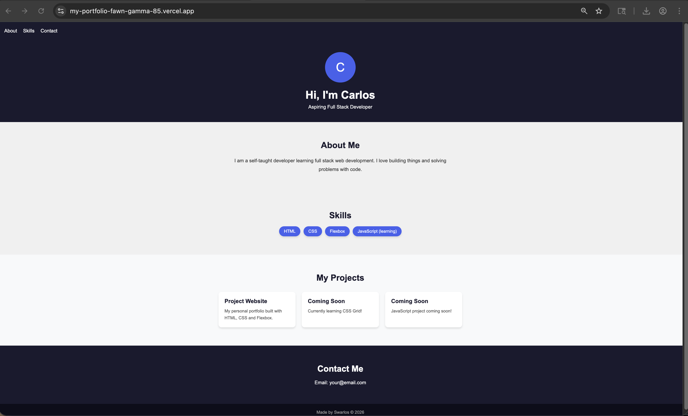

# 🚀 My Portfolio Website

Hey! I'm Swarlos — an aspiring full stack developer who loves building things with code.

This is my first project as a beginner and I'm proud of it! I'm still learning every day and this portfolio will keep growing as I pick up new skills and build more projects. Coding has been something I've been wanting to do for a long time and I'm finally doing it!

## 🌐 Live Demo

👉 [View Live Site](https://my-portfolio-fawn-gamma-85.vercel.app/)

## 🛠️ Built With

- HTML5
- CSS3
- Flexbox
- CSS Grid
- Responsive Design
- Git & GitHub
- JavaScript (learning)

## ✨ Features

- Responsive layout that works on mobile, tablet and desktop
- Smooth scrolling navigation
- Animated hover effects
- Skills section
- Projects section (more coming soon!)
- Clean dark theme design

## 📸 Screenshot



## 🗂️ Project Structure

```
my-portfolio/
├── index.html
└── styles.css
```

## 🚧 What's Coming Next

I'm currently learning JavaScript and will be adding:
- Interactive projects built with JavaScript
- A contact form
- More projects as I complete them
- Eventually React components

## 👨‍💻 About Me

I'm a self-taught developer working through a full stack web development roadmap. I learn 4-6 hours every day and I'm enjoying every step of the journey. This portfolio will grow with me as I learn more!

## 📬 Connect With Me

- GitHub: [@swarlosram](https://github.com/swarlosram)
- Live Site: [my-portfolio-fawn-gamma-85.vercel.app](https://my-portfolio-fawn-gamma-85.vercel.app/)

---

*This is just the beginning! Check back often to see new projects being added.* 🎉